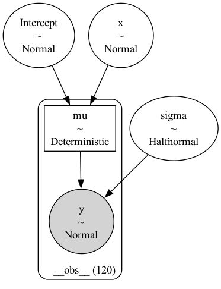
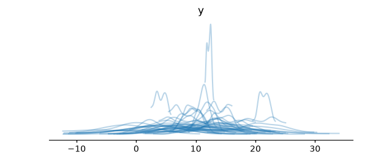
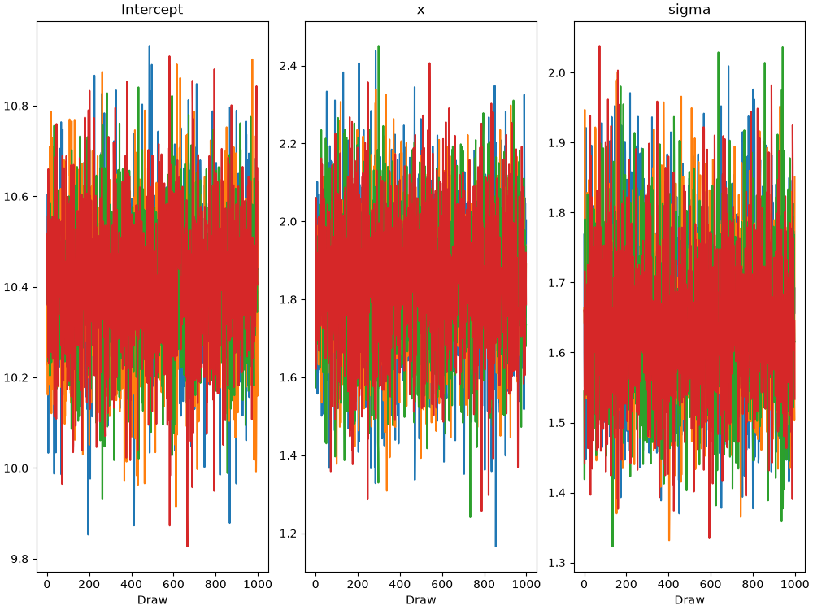
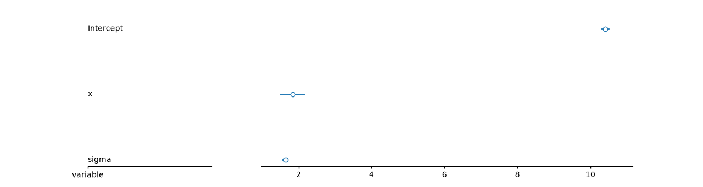
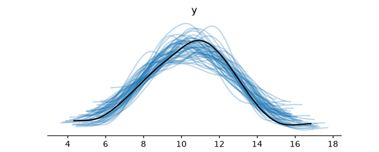
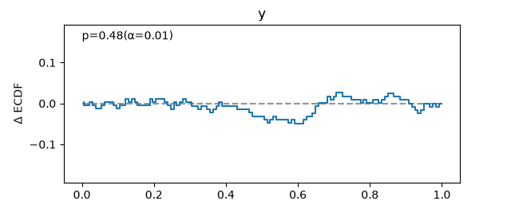
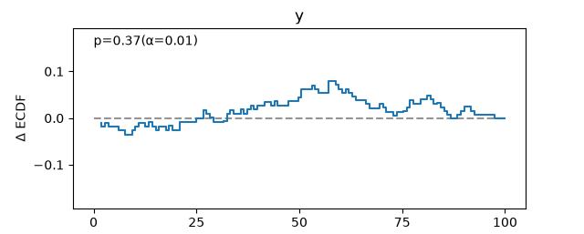
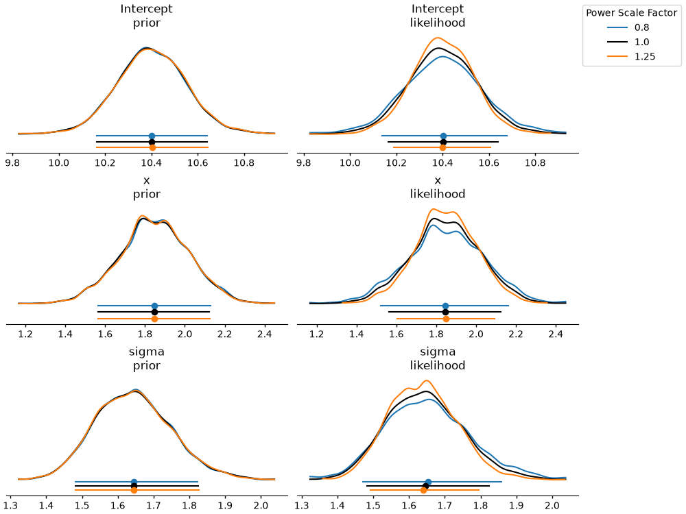

# Gaussian regression — Bayesian Analysis Report

## Executive Summary

Expected outcome difference: x=+0.5 minus x=-0.5, with a 94% HDI. Posterior mean: 1.847; 94% HDI [1.501, 2.161]. The contrast is a conditional association on the outcome scale, not a causal effect. All convergence diagnostics passed (R-hat ≤ 1.01, ESS adequate, no divergences). Prior sensitivity: low sensitivity (flagged: none).

## Data and Question

| Field | Value |
| --- | --- |
| Source | Generated synthetic teaching data |
| Sample size | 120 |
| Key variables | Numeric centered exposure; no categorical predictors; rows checked finite. |
| Question | How does expected y change when x increases from -0.5 to +0.5? |

Numeric centered exposure; no categorical predictors; rows checked finite.

## Model Specification

The model graph shows the directed structure of the generative process. Plates indicate replicated structure (e.g., over observations or groups). Shaded nodes are observed; unshaded nodes are latent parameters or hyperparameters with priors.

**Generative story.** Independent Normal outcomes with a linear exposure mean and common residual scale. Formula: `y ~ x`; family/link: gaussian/identity.

| Parameter | Prior | Justification |
| --- | --- | --- |
| mu:Intercept | Normal(mu: 10.0, sigma: 5.0) | Baseline Normal(10,5), slope Normal(0,3), and residual HalfNormal(3) express the measurement scale. |
| mu:x | Normal(mu: 0.0, sigma: 3.0) | Baseline Normal(10,5), slope Normal(0,3), and residual HalfNormal(3) express the measurement scale. |
| sigma | HalfNormal(sigma: 3.0) | Baseline Normal(10,5), slope Normal(0,3), and residual HalfNormal(3) express the measurement scale. |

## Prior Predictive Check

The prior predictive distribution shows the data the model would generate before seeing any observations, using only the priors. Plausible Bayesian models produce prior predictive samples that span — but do not wildly exceed — the range of the observed data. Tightly bunched priors that exclude the observed range indicate priors that are too narrow; priors that produce wildly implausible values (e.g., negative blood pressure, billion-dollar daily revenue) indicate priors that are too wide and should be tightened before sampling.

**Assessment:** The pooled 94% prior-predictive interval is [-3.00, 22.02]. This broad range covers the intended measurement scale; tails outside a plausible domain would require a prior or likelihood revision.

## Sampling and Convergence

| Diagnostic | Value | Status |
| --- | --- | --- |
| Max R-hat | None | pass |
| Min ESS (bulk) | Not returned by shared helper | pass |
| Min ESS (tail) | Not returned by shared helper | pass |
| Divergences | 0 | pass |

Trace plots show parameter draws in sampling order for each chain. Well-mixed chains explore similar ranges without persistent drift or sticking. Visible separation between chains, monotone drift, or stuck chains indicate non-convergence and the posterior should not be interpreted.

**Assessment:** All convergence diagnostics passed (R-hat ≤ 1.01, ESS adequate, no divergences). Sampling settings: `{'draws': 1000, 'tune': 1000, 'chains': 4, 'retained_draws_per_chain': 1000, 'backend': 'nutpie', 'omit_offsets': False, 'center_predictors': False}`.

## Posterior

The forest plot shows posterior medians (points) and credible intervals (lines) for the parameters of interest. Wide intervals indicate parameters the data are only weakly informative for; narrow intervals concentrated away from zero indicate strong evidence in a direction.

| Parameter | mean | sd | hdi94_lb | hdi94_ub | ess_bulk | ess_tail | r_hat | mcse_mean | mcse_sd |
| --- | --- | --- | --- | --- | --- | --- | --- | --- | --- |
| Intercept | 10.4 | 0.151 | 10.13 | 10.7 | 5718 | 2888 | 1.003 | 0.002008 | 0.002925 |
| x | 1.847 | 0.1745 | 1.501 | 2.161 | 5869 | 3140 | 1.003 | 0.002279 | 0.002793 |
| sigma | 1.645 | 0.1081 | 1.44 | 1.842 | 5684 | 3226 | 1.001 | 0.001432 | 0.001651 |

**Substantive interpretation.** The contrast is a conditional association on the outcome scale, not a causal effect.

Target: Expected outcome difference: x=+0.5 minus x=-0.5, with a 94% HDI.

| term | estimate_type | value | estimate | lower_3.0% | upper_97.0% |
| --- | --- | --- | --- | --- | --- |
| x | diff | -0.5_vs_0.5 | 1.847 | 1.501 | 2.161 |

## Posterior Predictive Check

The posterior predictive distribution shows what the fitted model implies the data should look like. A well-fitting model produces replicated samples that closely overlap the observed data across the full range. Systematic discrepancies — the model under-predicts the tails, misses a mode, or over-disperses — indicate model misspecification and should be addressed before drawing conclusions.

**Assessment:** Observed mean 10.41; 94% interval for replicated means [10.02, 10.82]. Agreement of the pooled distribution is only one check: inspect residual shape and changes in spread across exposure before trusting constant variance.

## Calibration

The PIT-ECDF plot tests whether the model's predictive distribution is calibrated — that is, whether stated credible levels match empirical coverage. The empirical CDF of probability integral transform values should fall within the simultaneous confidence bands. Departures from uniform PIT values can reflect location bias or dispersion errors; their shape matters. Use the separate coverage curve to assess interval coverage. These are fitted-data PPC-PIT checks, not held-out validation.

The coverage plot tests the same idea in coverage units: it asks whether nominal central credible intervals (50%, 80%, 95%) actually contain the stated fraction of the observed data. A well-calibrated model lies on the diagonal.

**Assessment:** Calibration is excellent — well-calibrated. This is a PPC-PIT assessment on the fitted data.

## Prior Sensitivity

| Parameter | prior | likelihood | diagnosis |
| --- | --- | --- | --- |
| Intercept | 0 | 0.094 | ✓ |
| x | 0.005 | 0.095 | ✓ |
| sigma | 0.003 | 0.117 | ✓ |

**Assessment:** Prior sensitivity: low sensitivity (flagged: none).

## Limitations and Threats

This section is mandatory. Rank threats by severity. For each: state the assumption that might be violated, the direction of bias if violated, and what additional data or design would resolve the threat.

1. Synthetic linear data cannot validate a real-data likelihood; pooled PPCs do not establish constant variance.
2. PPC-PIT reuses the fitted observations; it is not evidence of out-of-sample calibration or causal identification.

## Suggested Next Steps

1. All diagnostics are within acceptable bounds — proceed to interpretation. Translate posteriors into decision-relevant terms and document the model assumptions in the report.

## Appendix

Descriptive seed: `1993`. Resolved versions: `versions.json`. Full posterior summary: `summary.csv`. Native contrast/prediction results: `predictions.csv`.

| Package | Version |
| --- | --- |
| bambi | 0.21.0 |
| pymc | 6.3.2 |
| pytensor | 3.3.1 |
| formulae | 0.6.2 |
| arviz | 1.3.0 |
| arviz-stats | 1.3.2 |
| arviz-plots | 1.3.1 |
| nutpie | 0.16.11 |
| marimo | 0.24.2 |
| numpy | 2.5.3 |
| pandas | 3.0.5 |
| python | 3.12.13 |
