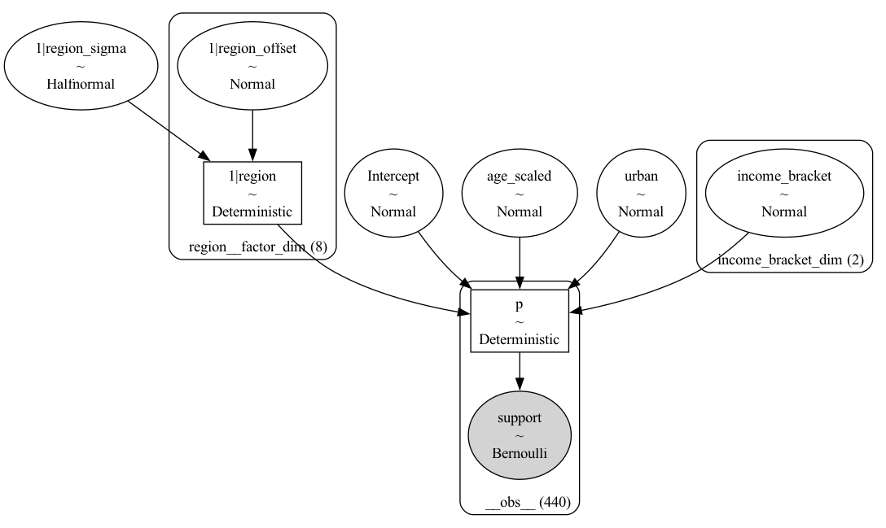
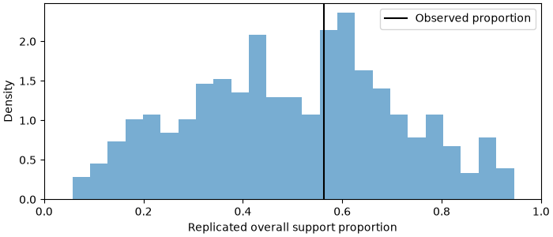
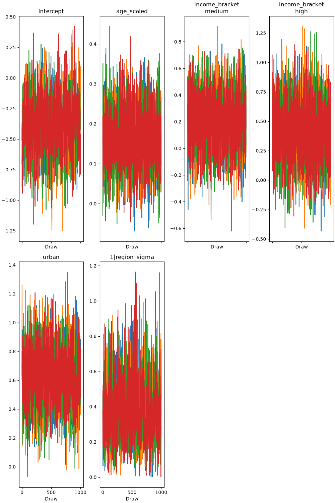
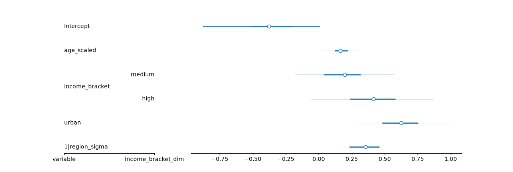
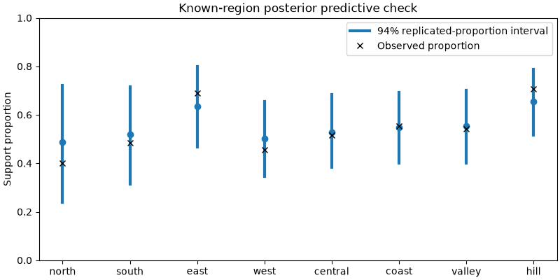
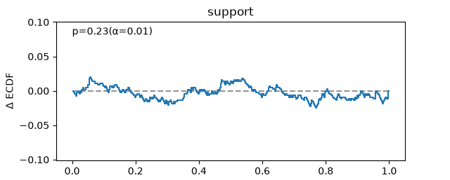
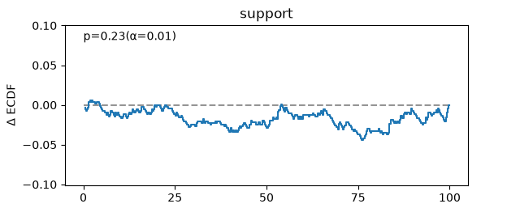
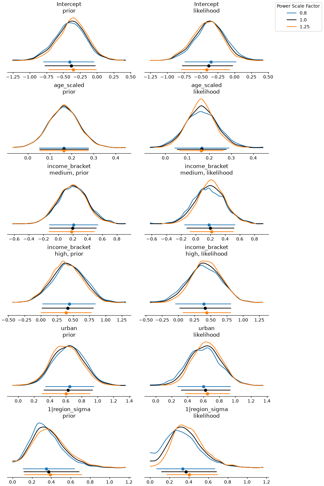

# Hierarchical Bernoulli regression — Bayesian Analysis Report

## Executive Summary

Conditional support probability at age 40, medium income, urban=1 in known north, with a 94% HDI; new-group sampling is not requested. Posterior mean: 0.540; 94% HDI [0.386, 0.681]. Region-specific probabilities describe modeled associations; they do not marginalize over unseen regions or identify a causal effect. All convergence diagnostics passed (R-hat ≤ 1.01, ESS adequate, no divergences). Prior sensitivity: strong sensitivity (flagged: 1|region_sigma).

## Data and Question

| Field | Value |
| --- | --- |
| Source | Generated synthetic teaching data |
| Sample size | 440 |
| Key variables | Support and urban are exactly 0/1; age_scaled=(age-40)/10. Ordered low/medium/high income treatment design is checked: low=[0,0], medium=[1,0], high=[0,1]. Eight regions have varying intercepts. |
| Question | What is support probability at age 40, medium income, urban=1 in the known north region? |

Support and urban are exactly 0/1; age_scaled=(age-40)/10. Ordered low/medium/high income treatment design is checked: low=[0,0], medium=[1,0], high=[0,1]. Eight regions have varying intercepts.

## Model Specification

The model graph shows the directed structure of the generative process. Plates indicate replicated structure (e.g., over observations or groups). Shaded nodes are observed; unshaded nodes are latent parameters or hyperparameters with priors.

**Generative story.** Conditionally independent Bernoulli outcomes with common age, income and urban effects and partially pooled region intercepts. Formula: `support ~ age_scaled + income_bracket + urban + (1|region)`; family/link: bernoulli/logit.

| Parameter | Prior | Justification |
| --- | --- | --- |
| p:Intercept | Normal(mu: 0.0, sigma: 1.0) | Log-odds intercept Normal(0,1), common slopes Normal(0,0.5), zero-mean Normal group deviations with HalfNormal(0.6) scale. |
| p:age_scaled | Normal(mu: 0.0, sigma: 0.5) | Log-odds intercept Normal(0,1), common slopes Normal(0,0.5), zero-mean Normal group deviations with HalfNormal(0.6) scale. |
| p:income_bracket | Normal(mu: 0.0, sigma: 0.5) | Log-odds intercept Normal(0,1), common slopes Normal(0,0.5), zero-mean Normal group deviations with HalfNormal(0.6) scale. |
| p:urban | Normal(mu: 0.0, sigma: 0.5) | Log-odds intercept Normal(0,1), common slopes Normal(0,0.5), zero-mean Normal group deviations with HalfNormal(0.6) scale. |
| p:1\|region | Normal(mu: 0.0, sigma: HalfNormal(sigma: 0.6)) | Log-odds intercept Normal(0,1), common slopes Normal(0,0.5), zero-mean Normal group deviations with HalfNormal(0.6) scale. |

## Prior Predictive Check

The prior predictive distribution shows the data the model would generate before seeing any observations, using only the priors. Plausible Bayesian models produce prior predictive samples that span — but do not wildly exceed — the range of the observed data. Tightly bunched priors that exclude the observed range indicate priors that are too narrow; priors that produce wildly implausible values (e.g., negative blood pressure, billion-dollar daily revenue) indicate priors that are too wide and should be tightened before sampling.

**Assessment:** The pooled 94% interval for prior-predictive support rates is [0.14, 0.89]. The prior permits substantial uncertainty without assuming all regions are identical. This pooled check must be complemented by domain judgments about regional variation.

## Sampling and Convergence

| Diagnostic | Value | Status |
| --- | --- | --- |
| Max R-hat | None | pass |
| Min ESS (bulk) | Not returned by shared helper | pass |
| Min ESS (tail) | Not returned by shared helper | pass |
| Divergences | 0 | pass |

Trace plots show parameter draws in sampling order for each chain. Well-mixed chains explore similar ranges without persistent drift or sticking. Visible separation between chains, monotone drift, or stuck chains indicate non-convergence and the posterior should not be interpreted.

**Assessment:** All convergence diagnostics passed (R-hat ≤ 1.01, ESS adequate, no divergences). Sampling settings: `{'draws': 1000, 'tune': 1000, 'chains': 4, 'retained_draws_per_chain': 1000, 'backend': 'nutpie', 'omit_offsets': False, 'center_predictors': False}`.

## Posterior

The forest plot shows posterior medians (points) and credible intervals (lines) for the parameters of interest. Wide intervals indicate parameters the data are only weakly informative for; narrow intervals concentrated away from zero indicate strong evidence in a direction.

| Parameter | mean | sd | hdi94_lb | hdi94_ub | ess_bulk | ess_tail | r_hat | mcse_mean | mcse_sd |
| --- | --- | --- | --- | --- | --- | --- | --- | --- | --- |
| Intercept | -0.3829 | 0.2319 | -0.8769 | 0.006649 | 1170 | 1347 | 1.002 | 0.006828 | 0.005129 |
| age_scaled | 0.1646 | 0.06926 | 0.03085 | 0.2923 | 4949 | 3096 | 1.001 | 0.0009853 | 0.001166 |
| income_bracket[medium] | 0.1968 | 0.198 | -0.178 | 0.5661 | 3181 | 2684 | 1.002 | 0.00351 | 0.002965 |
| income_bracket[high] | 0.416 | 0.248 | -0.05713 | 0.867 | 3907 | 3098 | 1 | 0.003968 | 0.004006 |
| urban | 0.6265 | 0.1934 | 0.2786 | 0.9898 | 2651 | 2432 | 1.001 | 0.003758 | 0.002935 |
| 1\|region_sigma | 0.3717 | 0.1771 | 0.0294 | 0.6968 | 951.4 | 969.2 | 1.002 | 0.005543 | 0.003622 |

**Substantive interpretation.** Region-specific probabilities describe modeled associations; they do not marginalize over unseen regions or identify a causal effect.

Target: Conditional support probability at age 40, medium income, urban=1 in known north, with a 94% HDI; new-group sampling is not requested.

| age_scaled | income_bracket | urban | region | estimate | lower_3.0% | upper_97.0% |
| --- | --- | --- | --- | --- | --- | --- |
| 0 | medium | 1 | north | 0.5402 | 0.3862 | 0.6808 |

## Posterior Predictive Check

The posterior predictive distribution shows what the fitted model implies the data should look like. A well-fitting model produces replicated samples that closely overlap the observed data across the full range. Systematic discrepancies — the model under-predicts the tails, misses a mode, or over-disperses — indicate model misspecification and should be addressed before drawing conclusions.

**Assessment:** Observed support proportion 0.56; replicated pooled 94% interval [0.50, 0.62]. Compare regional observed and predicted proportions as well: pooled agreement can hide a region-specific failure. A binary histogram alone is not a calibration check.

## Calibration

The PIT-ECDF plot tests whether the model's predictive distribution is calibrated — that is, whether stated credible levels match empirical coverage. The empirical CDF of probability integral transform values should fall within the simultaneous confidence bands. Departures from uniform PIT values can reflect location bias or dispersion errors; their shape matters. Use the separate coverage curve to assess interval coverage. These are fitted-data PPC-PIT checks, not held-out validation.

The coverage plot tests the same idea in coverage units: it asks whether nominal central credible intervals (50%, 80%, 95%) actually contain the stated fraction of the observed data. A well-calibrated model lies on the diagonal.

**Assessment:** Calibration is excellent — well-calibrated. This is a PPC-PIT assessment on the fitted data.

## Prior Sensitivity

| Parameter | prior | likelihood | diagnosis |
| --- | --- | --- | --- |
| Intercept | 0.092 | 0.103 | potential prior-data conflict |
| age_scaled | 0.012 | 0.09 | ✓ |
| income_bracket[medium] | 0.055 | 0.107 | potential prior-data conflict |
| income_bracket[high] | 0.087 | 0.108 | potential prior-data conflict |
| urban | 0.082 | 0.134 | potential prior-data conflict |
| 1\|region_sigma | 0.119 | 0.164 | potential prior-data conflict |

**Assessment:** Prior sensitivity: strong sensitivity (flagged: 1|region_sigma).

## Limitations and Threats

This section is mandatory. Rank threats by severity. For each: state the assumption that might be violated, the direction of bias if violated, and what additional data or design would resolve the threat.

1. Synthetic unequal region samples; no survey weighting or poststratification. This known-region conditional probability is not an overall population estimate or a causal effect.
2. PPC-PIT reuses the fitted observations; it is not evidence of out-of-sample calibration or causal identification.

## Suggested Next Steps

1. Strong prior sensitivity on 1|region_sigma — either justify the informative prior explicitly with domain knowledge, or widen it and refit. Report both versions if the substantive conclusion changes.

## Appendix

Descriptive seed: `2264`. Resolved versions: `versions.json`. Full posterior summary: `summary.csv`. Native contrast/prediction results: `predictions.csv`.

| Package | Version |
| --- | --- |
| bambi | 0.21.0 |
| pymc | 6.3.2 |
| pytensor | 3.3.1 |
| formulae | 0.6.2 |
| arviz | 1.3.0 |
| arviz-stats | 1.3.2 |
| arviz-plots | 1.3.1 |
| nutpie | 0.16.11 |
| marimo | 0.24.2 |
| numpy | 2.5.3 |
| pandas | 3.0.5 |
| python | 3.12.13 |
