# Flat analytical DDM — Bayesian Analysis Report

## Executive Summary

Inspect choice proportions and conditional RT quantiles together. Posterior parameters describe this DDM, not causal or model-free cognitive effects. All convergence diagnostics passed (R-hat ≤ 1.01, ESS adequate, no divergences). Prior sensitivity: low sensitivity (flagged: none). RT margin: Calibration is fair — non-uniform predictive PIT; no dominant mean coverage direction. Choice margin: Calibration is excellent — well-calibrated. This is a synthetic teaching analysis, not a real-data conclusion.

## Data and Question

| Field | Value |
| --- | --- |
| Source | Synthetic DDM teaching data |
| N | 300 |
| Question | Does a flat DDM describe the joint RT and choices in the generated two-choice task? |

RT is in seconds; responses -1/+1 refer to declared boundaries. No missing trials, deadlines, or lapse mixture are modeled.

## Model Specification

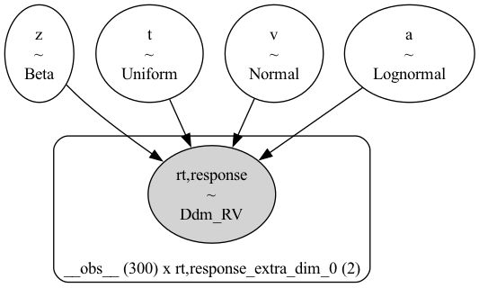

The model graph shows the directed structure of the generative process. Plates indicate replicated structure (e.g., over observations or groups). Shaded nodes are observed; unshaded nodes are latent parameters or hyperparameters with priors.

**Generative story.** Constant-drift, constant-boundary DDM with scalar v, a, z and t; no lapses, deadlines or missing responses.

v Normal(0,1.5); a LogNormal(log(1.2),0.35); z Beta(2,2); t Uniform(0,0.38673579096794125), with an explicitly data-informed upper bound.

```text
Hierarchical Sequential Sampling Model
Model: ddm

Response variable: rt,response
Likelihood: analytical
Observations: 300

Parameters:

v:
    Prior: Normal(mu: 0.0, sigma: 1.5)
    Explicit bounds: (-inf, inf)

a:
    Prior: LogNormal(mu: 0.1823, sigma: 0.35)
    Explicit bounds: (0.0, inf)

z:
    Prior: Beta(alpha: 2.0, beta: 2.0)
    Explicit bounds: (0.0, 1.0)

t:
    Prior: Uniform(lower: 0.0, upper: 0.3867)
    Explicit bounds: (0, 0.38673579096794125)

```

| Parameter | Resolved prior |
| --- | --- |
| v | Normal(mu: 0.0, sigma: 1.5) |
| a | LogNormal(mu: 0.1823, sigma: 0.35) |
| z | Beta(alpha: 2.0, beta: 2.0) |
| t | Uniform(lower: 0.0, upper: 0.3867) |

## Prior Predictive Check

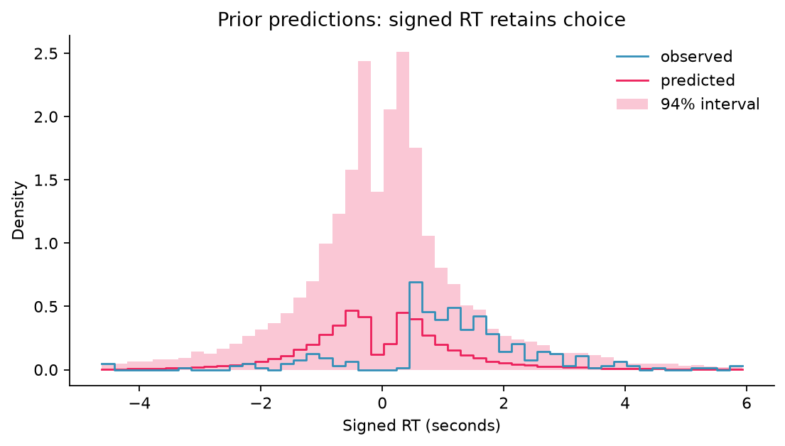

The prior predictive samples come from the specified priors before posterior fitting. Here the upper bound for t is set from the observed minimum RT, so this check uses a data-informed prior and is not independent of the observations. Plausible Bayesian models produce prior predictive samples that span — but do not wildly exceed — the range of the observed data. Tightly bunched priors that exclude the observed range indicate priors that are too narrow; priors that produce wildly implausible values (e.g., negative blood pressure, billion-dollar daily revenue) indicate priors that are too wide and should be tightened before sampling.

**Assessment:** The observed +1 choice fraction is 0.873; the central 94% prior-predictive interval for that fraction is [0.000, 1.000]. The table also compares observed RT quantiles separately for each choice. These are descriptive comparisons, not a calibration test or an automatic prior-adequacy verdict. The Normal drift, positive LogNormal boundary, Beta starting-point and restricted Uniform non-decision-time priors express plausible teaching assumptions; their suitability still depends on the task and RT measurement process. Inspect excessively slow tails, implausibly fast RTs, and extreme choice imbalance before fitting. Revisit the explicit data-informed t upper bound when applying this workflow to real observations. Conditional quantiles omit replicates without that choice; their counts are reported below.

| stage | choice | quantity | observed | predicted_mean | lower_94 | upper_94 | replicates_with_quantity | total_replicates |
| --- | --- | --- | --- | --- | --- | --- | --- | --- |
| prior_predictive | -1 | choice proportion | 0.1267 | 0.525 | 0 | 1 | 200 | 200 |
| prior_predictive | -1 | RT q=0.1 (s) | 0.679 | 0.5689 | 0.1364 | 1.459 | 189 | 200 |
| prior_predictive | -1 | RT q=0.5 (s) | 1.195 | 0.98 | 0.2392 | 2.498 | 189 | 200 |
| prior_predictive | -1 | RT q=0.9 (s) | 2.607 | 2.07 | 0.5122 | 5.829 | 189 | 200 |
| prior_predictive | 1 | choice proportion | 0.8733 | 0.475 | 0 | 1 | 200 | 200 |
| prior_predictive | 1 | RT q=0.1 (s) | 0.5739 | 0.5409 | 0.1029 | 1.446 | 184 | 200 |
| prior_predictive | 1 | RT q=0.5 (s) | 1.292 | 0.9554 | 0.1976 | 2.575 | 184 | 200 |
| prior_predictive | 1 | RT q=0.9 (s) | 2.91 | 1.989 | 0.4115 | 5.577 | 184 | 200 |

## Sampling and Convergence

| Diagnostic | Value | Status |
| --- | --- | --- |
| Max R-hat | 1.005 | pass |
| Min ESS (bulk) | 791.6 | pass |
| Min ESS (tail) | 973.7 | pass |
| Divergences | 0 | pass |

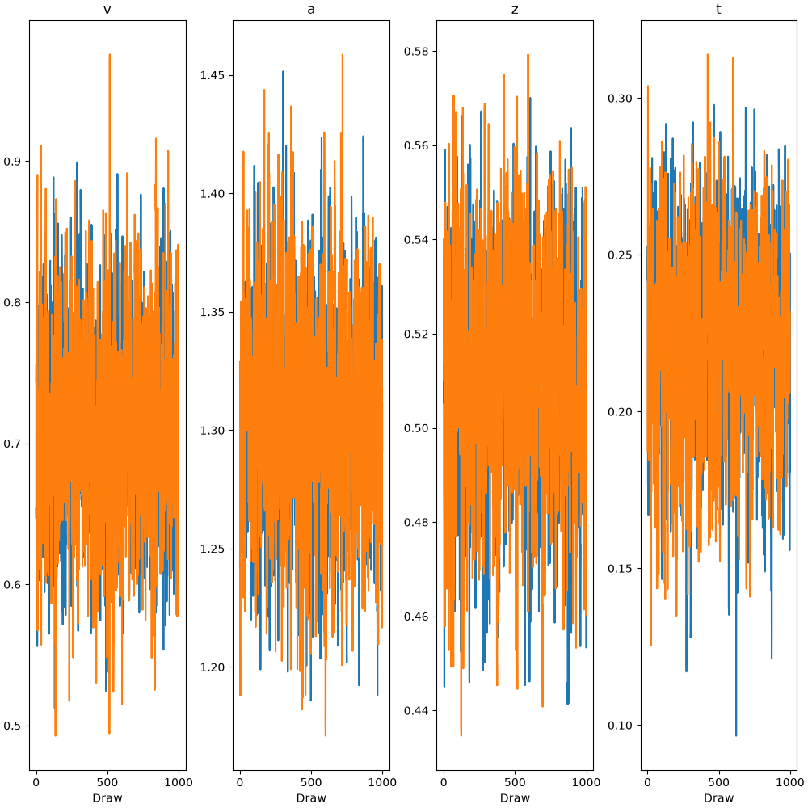

Trace plots show parameter draws in sampling order for each chain. Well-mixed chains explore similar ranges without persistent drift or sticking. Visible separation between chains, monotone drift, or stuck chains indicate non-convergence and the posterior should not be interpreted.

**Assessment:** All convergence diagnostics passed (R-hat ≤ 1.01, ESS adequate, no divergences). Settings: `{'sampler': 'pymc', 'draws': 1000, 'tune': 1000, 'chains': 2, 'cores': 1, 'random_seed': 1414, 'target_accept': 0.9}`. Missing extrema in the shared diagnostic output are taken from summary.csv; pass/flag statuses retain the shared assessment.

## Posterior

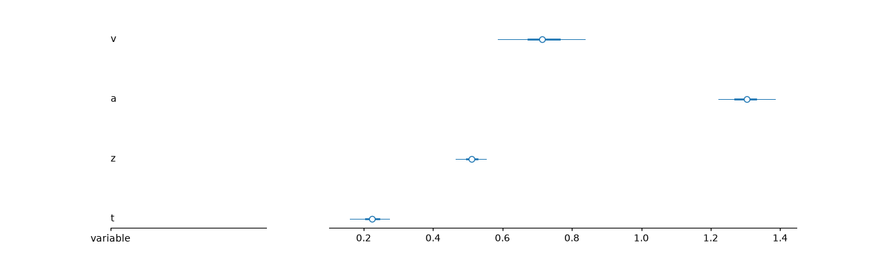

The forest plot shows posterior medians (points) and 50% and 94% HDIs (lines). Interval width describes posterior uncertainty on each parameter's own scale; compare priors and posteriors before attributing precision to the data. Interpret drift v relative to 0 and normalized starting point z relative to 0.5. For a and t, excluding zero reflects their positive support and is not itself evidence of a directional effect.

| Parameter | mean | sd | hdi94_lb | hdi94_ub | ess_bulk | ess_tail | r_hat | mcse_mean | mcse_sd |
| --- | --- | --- | --- | --- | --- | --- | --- | --- | --- |
| v | 0.7134 | 0.06784 | 0.5879 | 0.8413 | 1134 | 1088 | 1.001 | 0.002014 | 0.001422 |
| a | 1.304 | 0.04406 | 1.224 | 1.388 | 984.3 | 1126 | 1.002 | 0.001406 | 0.0009735 |
| z | 0.5098 | 0.02348 | 0.4634 | 0.5512 | 901.9 | 998.4 | 1 | 0.0007867 | 0.0005459 |
| t | 0.2223 | 0.03046 | 0.1615 | 0.2741 | 791.6 | 973.7 | 1.005 | 0.001093 | 0.0007906 |

**Substantive interpretation.** Inspect choice proportions and conditional RT quantiles together. Posterior parameters describe this DDM, not causal or model-free cognitive effects. The table reports parameter means and 94% HDIs; these do not identify a unique psychological explanation or a causal effect.

## Posterior Predictive Check

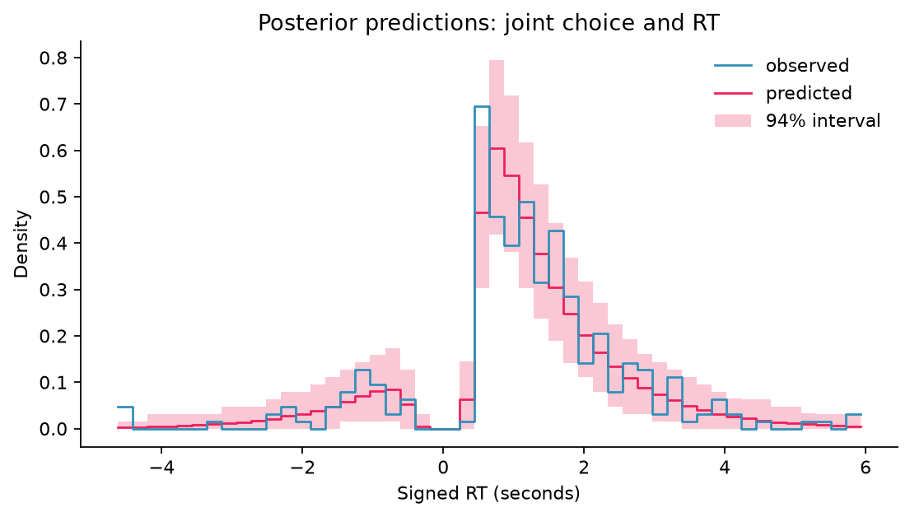

The posterior predictive distribution shows what the fitted model implies the data should look like. A well-fitting model produces replicated samples that closely overlap the observed data across the full range. Systematic discrepancies — the model under-predicts the tails, misses a mode, or over-disperses — indicate model misspecification and should be addressed before drawing conclusions.

**Assessment:** Compare both choices and their conditional RT distributions. The following are replicated-statistic intervals, not parameter HDIs.

| stage | choice | quantity | observed | predicted_mean | lower_94 | upper_94 | replicates_with_quantity | total_replicates |
| --- | --- | --- | --- | --- | --- | --- | --- | --- |
| posterior_predictive | -1 | choice proportion | 0.1267 | 0.1274 | 0.08 | 0.18 | 2000 | 2000 |
| posterior_predictive | -1 | RT q=0.1 (s) | 0.679 | 0.6615 | 0.4924 | 0.8633 | 2000 | 2000 |
| posterior_predictive | -1 | RT q=0.5 (s) | 1.195 | 1.311 | 0.9667 | 1.718 | 2000 | 2000 |
| posterior_predictive | -1 | RT q=0.9 (s) | 2.607 | 2.891 | 2.046 | 4.004 | 2000 | 2000 |
| posterior_predictive | 1 | choice proportion | 0.8733 | 0.8726 | 0.82 | 0.92 | 2000 | 2000 |
| posterior_predictive | 1 | RT q=0.1 (s) | 0.5739 | 0.614 | 0.5461 | 0.6808 | 2000 | 2000 |
| posterior_predictive | 1 | RT q=0.5 (s) | 1.292 | 1.259 | 1.12 | 1.416 | 2000 | 2000 |
| posterior_predictive | 1 | RT q=0.9 (s) | 2.91 | 2.918 | 2.513 | 3.401 | 2000 | 2000 |

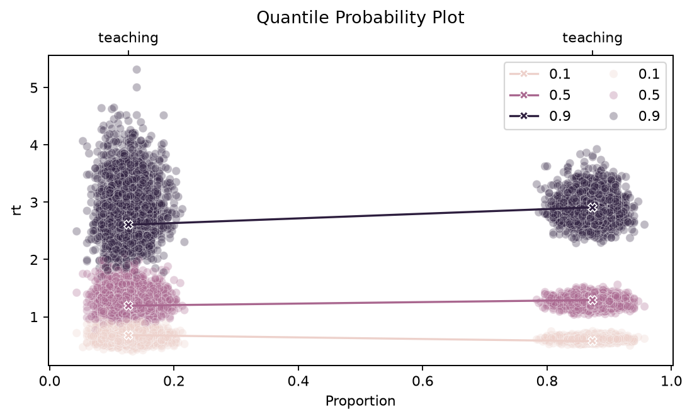

In this quantile-probability plot, the left cluster represents response -1 and the right cluster response +1. Crosses joined by lines show observed quantiles; dots show quantiles from predictive replicates. Colors identify the 0.1, 0.5 and 0.9 RT quantiles, and the horizontal position shows each choice's proportion.

## Calibration

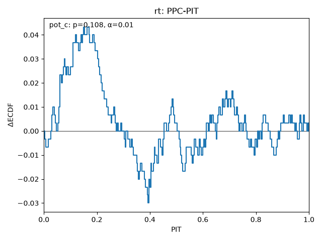

The PIT plot shows the empirical CDF of probability integral transform values minus the uniform CDF (ΔECDF), with a horizontal zero line as the uniform reference. Departures can reflect location bias or dispersion errors; their shape matters. Modern ArviZ output uses a p-value annotation from the `pot_c` test; older supported output may use a simulated reference envelope. Report the method and settings recorded in `calibration.json` and interpret the corresponding plot. Discrete outcomes use randomized PIT values; for a binary choice check, label the response coding and randomization explicitly. Treat fitted-data marginal PPC-PIT as model criticism: passing these checks does not establish joint, conditional or held-out calibration.

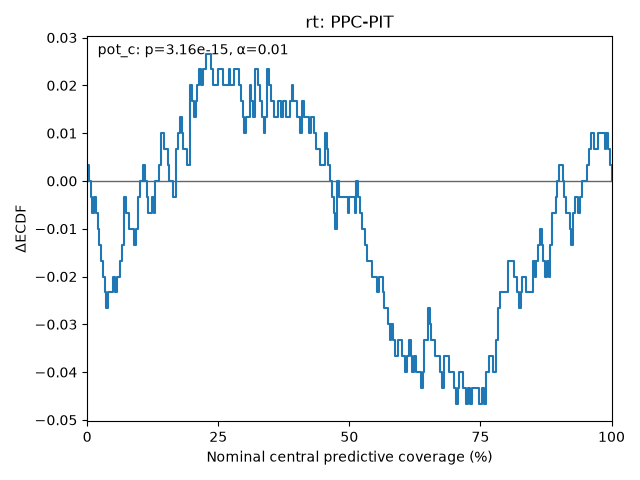

The coverage plot applies the same ΔECDF display to coverage-transformed PIT values. In modern ArviZ output, its x-axis gives nominal central predictive coverage in percent and its y-axis gives the ECDF difference, with agreement represented by the horizontal zero line. Interpret its p-value annotation or legacy reference envelope using the recorded method, alongside the original PIT check. Coverage deviations describe this predictive check and do not by themselves identify a unique model defect or demonstrate performance on new observations.

**Assessment:** **Marginal RT:** Calibration is fair — non-uniform predictive PIT; no dominant mean coverage direction.

**Marginal choice (+1):** Calibration is excellent — well-calibrated.

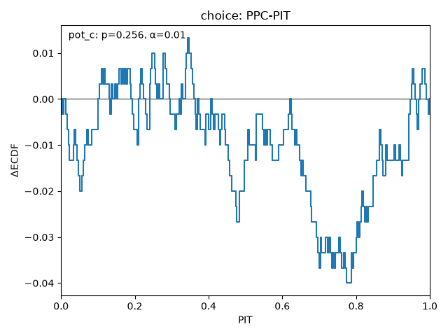

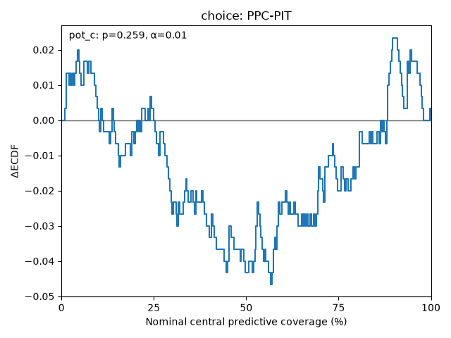

These use separate scalar PPC views. Passing both does not establish joint RT/choice, conditional, or held-out calibration.

## Prior Sensitivity

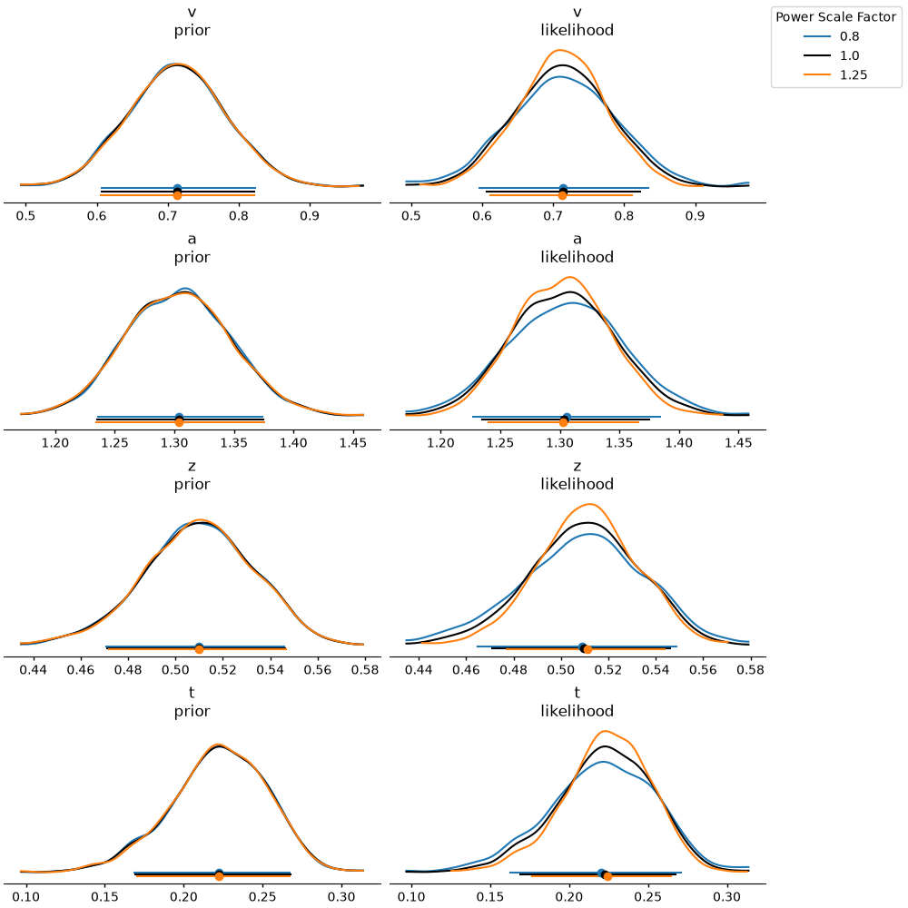

| Parameter | prior | likelihood | diagnosis |
| --- | --- | --- | --- |
| v | 0.006 | 0.094 | ✓ |
| a | 0.011 | 0.092 | ✓ |
| z | 0.004 | 0.111 | ✓ |
| t | 0.007 | 0.117 | ✓ |

**Assessment:** Prior sensitivity: low sensitivity (flagged: none).

## Limitations and Threats

This section is mandatory. Rank threats by severity. For each: state the assumption that might be violated, the direction of bias if violated, and what additional data or design would resolve the threat.

1. This single synthetic teaching run cannot establish general parameter recovery. Fitted-data marginal RT/choice PPC-PIT does not establish joint, conditional, or held-out calibration. The PyMC log-prior bridge is verified here only for this flat model with default sample coordinates; power sensitivity does not assess changes to the data-informed t support policy.
2. Fitted-data PPC-PIT reuses observations; it is not held-out validation.
3. Two calibrated marginals do not establish the joint RT/choice distribution.
4. Use choice proportions and conditional RT quantiles as additional domain checks.
5. No marginal log-likelihood is supplied; do not run LOO-PIT on these views.

## Suggested Next Steps

1. Investigate the rt marginal PPC-PIT discrepancy alongside choice proportions and conditional RT tails. Revisit RT units, t support, priors and the DDM task assumptions before considering a separately validated model extension.
2. Review choice proportions and conditional RT quantiles together, including absent-choice replicate counts. Interpret parameters only when the available convergence and domain checks support the intended claim.

## Appendix

Joint-trial LOO: LOO Pareto-k: excellent.

Descriptive seed: `1412`. Predictive RNG settings: `{'prior_draws': 200, 'prior_seed': 1413, 'posterior_draws_per_chain': 'All retained posterior draws (draws=None); preserve complete sample coordinates.', 'safe_mode': True, 'posterior_random_seed': "HSSM 0.5.0's public posterior predictive API has no random_seed argument; no seeded repeatability claim is made for those draws."}`.

Artifacts: `inference_data.nc` (joint fit), `prior_data.nc`, `domain_checks.csv`, `summary.csv`, and the scoped `calibration/` outputs.

| Package | Version |
| --- | --- |
| hssm | 0.5.0 |
| bambi | 0.19.0 |
| pymc | 6.1.0 |
| pytensor | 3.1.3 |
| ssm-simulators | 0.14.0 |
| arviz | 1.2.0 |
| arviz-stats | 1.2.0 |
| arviz-plots | 1.2.0 |
| numpy | 2.4.6 |
| marimo | 0.24.2 |
| python | 3.12.13 |
